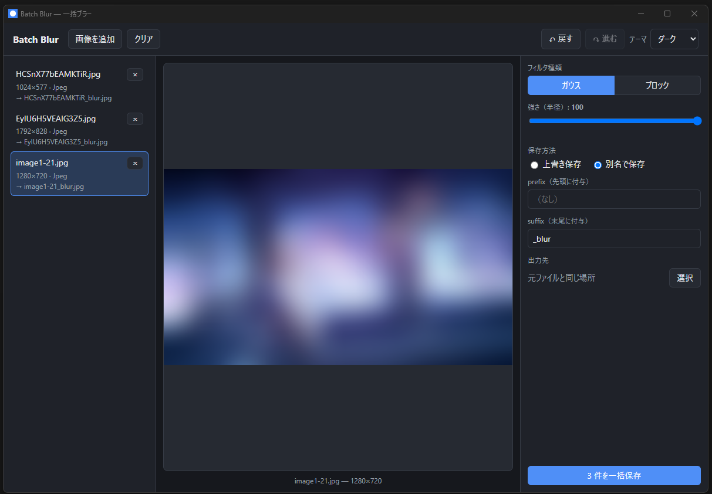

<style>
section blockquote>blockquote>blockquote {
  font-size: 50%;
  font-weight: 400;
  padding: 0;
  margin: 0;

  /* 絶対配置の設定 */
  position: absolute;
  bottom: 70px;
  left: 70px;
  right: 70px;

  /* ボーダースタイル */
  border: 0;
  border-top: 0.1em dashed #555;
}

section img {
  display: block;
  margin: 0 auto;
}

/* データ比較表はスライド高に収まるよう字詰め（縦はみ出し防止） */
section table {
  font-size: 0.62em;
  margin: 0.3em auto;
}
section th,
section td {
  padding: 3px 9px;
}
</style>

<!-- _class: lead -->
# batch-blur
## Tauri v2 で作る一括画像ブラー

吉澤亜斗武

---

# なぜ作ったか（1）
社内勉強会のために作った資料を公開しようとすると修正が必要なことがある．
- 社内の機密情報
- 他社のプラットフォーム / プロダクトの情報
- クライアント周りの情報

画像の場合は具体的なコンテンツは隠したいが，表示の大まかなイメージやレイアウト構成などを提示したいためにノイズフィルターを適用したいことがある．

---

# なぜ作ったか（2）
画像が多い場合だと結構大変．
- 一般的な画像編集ソフトは，一括処理は苦手（バッチ機能がない／あっても手順が煩雑で，1枚ずつ処理すると手間がかかる）
- CLI ツールなら一括適用できるが，フィルターの強さが適切かプレビューできない．そもそもCLIは非技術者にはハードルが高く，使える人が限られる．

---

# 成果物
- 複数画像を読み込み → ブラー設定 → **一括書き出し** するデスクトップアプリ
https://github.com/yAtomtom/batch-blur



---

# アジェンダ

## 1. Tauri v2 の技術選定
## 2. アーキテクチャ（責務分割・IPC 境界・レイヤリング）
## 3. WYSIWYG プレビューの設計
## 4. 分離可能ボックスブラーと O(n)

---

<!-- _class: lead -->
# 1. Tauri v2 の技術選定

---

## 技術選定の評価軸
- 処理速度は個人で使うスケールでは大きな問題にならず，必要に応じて改善
- → **優先度の高い軸で選定し、速度は決め手にしない**

| 評価軸（候補） | 本アプリでの優先度 |
|---|---|
| 配布容易性（単一バイナリ・小サイズ） | **高** |
| 保守性（WYSIWYG・単一実装・テスト容易） | **高** |
| 安全性（メモリ安全・権限モデル） | **高** |
| メモリ（実行時フットプリント） | 中 |
| 処理速度（ピクセル処理の速さ） | **低**（中規模バッチで差が出ない） |

---

## なぜ Tauri v2 か

- **軽量**（バイナリ小・メモリ小）
- **Rust バックエンド**（型安全・ネイティブなピクセル処理）
- **OS 標準 WebView**（Chromium を同梱しない）

| FW | 言語 | 描画 | アイドルRAM | バンドル |
|---|---|---|---|---|
| Electron | JS | Chromium 同梱 | ~150–300MB | ~85–150MB |
| **Tauri v2** | **Rust** | OS WebView | ~30–80MB | **~0.6–3MB** |
| Wails v2 | Go | OS WebView | ~10MB* | ~15MB* |
| Flutter | Dart | Skia | ~20–35MB | ~18MB+ |
| Avalonia | C# | Skia | 低 | 数MB〜 |
| Qt | C++ | ネイティブ | 数十MB | ~50–70MB |

<!-- note: 数値＝「最小〜小規模アプリ・アイドル時」を OS 標準ツール(Task Manager/Activity Monitor)で計測した公開ベンチの目安（*=vendor公称）。RSS/PSS/USS・OS/HW で変動し、vendor公称と第三者実測が混在。詳細な前提と N=1 出典は次頁。出典 levminer 実測（実アプリ Authme）, gethopp ブログ実測, Wails 公式 docs（v3 のページの公称値を v2 行の目安に流用）, Flutter #148641, Qt deploy docs -->

> > > **Skia**＝アプリが自前でピクセルを描く 2D 描画エンジン（全 OS で同一の見た目）／**ネイティブ**＝OS 標準ウィジェットで描画（OS 純正の見た目・挙動）

---

## メモリ優位の前提と限界

- Windows は WebView2 = Chromium → 実行時RAMは Electron と大差なく、**計測法次第で逆転もある**
- 差が明確なのは **macOS / Linux**（OS が WebView を共有し専有コピーを持たない分、実効メモリが小さい）
- 代表ベンチは**測定法依存かつ N=1**（実アプリ1本の単機計測）で、**一般化には注意**

<!-- note: #5889 は公式ベンチ mprof の psutil(RSS) 既定が Chromium 共有メモリを二重計上する点を指摘。WebView 依存の裏返し＝OS 更新に追従で互換差、Linux は WebKitGTK 依存（Electron は同梱で全 OS 一致） -->

> > > 代表実測: Electron ~200–300MB / Tauri ~30–40MB（最小〜小規模アプリのアイドル時, OS 標準ツール計測）。**N=1 出典＝levminer**（実アプリ Authme を単機計測）。測定法の争点＝**Tauri #5889**（RSS が Chromium 共有メモリを二重計上、PSS/USS で結果が変わる）

---

## Tauri v1 → v2: 何が変わったか

- **モバイル対応**（iOS/Android）が目玉 — 本アプリは未使用だが v2 の中核
- **コア機能のプラグイン化** — 本アプリの `tauri-plugin-dialog` も v2 プラグイン
- **セキュリティ刷新**: v1 の allowlist → **Capabilities / Permissions**（`capabilities/default.json`）
- **IPC 強化**: `Channel` でストリーミング（進捗 `ExportProgress` に活用）
- 設定 `tauri.conf.json` 再編・Rust API 変更で **v1 とは非互換**（移行作業が必要）

<!-- note: 本アプリは tauri 2.x 系。capabilities / tauri-plugin-dialog / Channel は v2 固有。v1→v2 移行は allowlist→capabilities 変換と設定キー再編が要注意 -->

---

## プラグイン化・権限・IPC — 何がうれしいか

| 概念 | 何か | うれしさ |
|---|---|---|
| **プラグイン化** | コア機能を本体から切り出し、必要分だけ導入する仕組み | 使う機能だけ＝**軽い・攻撃面が小**／本体と独立に更新・拡張 |
| **Capabilities / Permissions** | 「どの window が どの API を呼べるか」を宣言的に制限する権限モデル | **最小権限を強制**／WebView が触れるネイティブ API を限定・監査可能 |
| **IPC**（Inter-Process Communication／プロセス間通信） | Web(JS) ↔ Rust の別プロセスを繋ぐ呼び出し・データ交換 | 重い/危険な処理を **Rust に隔離**／型付き境界・`Channel` で逐次配信 |

> > > **プラグイン化**＝機能を crates/npm のように付け外し。使わない機能を同梱しない→軽く安全、コミュニティ拡張が容易／**Capabilities/Permissions**＝v1 の allowlist（全体 ON/OFF）を window×API 単位の細粒度 ACL に（permission＝個々の許可、capability＝束ねて window に付与）。XSS/サプライチェーン被害を限定、JSON で監査可／**IPC**＝WebView と Rust は別プロセス。invoke() で呼び出し、Channel/Event で逆方向。v2 の Channel は1件ずつ stream（逐次UI更新に活用。キャンセルは Channel の機能ではなく `cancel_export`＋AtomicBool フラグで実現）

---

## ピクセル処理の言語・ライブラリ選定

- **Canvas**（ブラウザ標準の描画API）でも描けるが、**JS(プレビュー)と Rust(書き出し)の二重実装**は見た目がズレる
- → **Rust に一本化**、同一コードで **見たまま出力（WYSIWYG）**
- **型安全・ネイティブ速度・単一バイナリ**も両立。各言語のライブラリは？

| エコシステム | 主ライブラリ | 種別 | 速度帯 |
|---|---|---|---|
| C/C++ | OpenCV / libvips / Skia | ネイティブSIMD | 最速（gold standard）|
| Node | sharp(libvips) / jimp | native / 純JS | sharp最速 / jimp ~40–50×遅 |
| Python | OpenCV / Pillow | ネイティブbinding | 速い |
| **Rust** | **image / imageproc** | **純Rust** | 中（SIMD薄い）|
| Go | imaging / bimg(libvips) | 純Go / native | まちまち |
| .NET | ImageSharp / SkiaSharp | managed / native | 中 |
| Java | Java2D ConvolveOp | managed | 低（分離実装なし）|

<!-- note: gold standard は OpenCV/libvips。実務論点（EXIF回転・ICC/色空間・I/O ボトルネック・巨大画像時の libvips 切替閾値）は速度とは別軸。出典 sharp 公式 performance ベンチ（jimp 比較込み）, libvips 公式ベンチ, OpenCV filter docs, imageproc docs -->

---

## 技術選定の妥当性と弱み

- **妥当な点**: メモリ安全＋単一バイナリ（libjpeg 等 C 依存を同梱せず配布容易）＋プレビュー/書き出しで同一実装（WYSIWYG）
- **弱み**: 最速ではない — 事実上の標準は OpenCV/libvips。`imageproc` は rayon 並列はあるが SIMD 前面設計ではない（特定条件で数倍改善の報告あり）
- **なぜ今 imageproc か**: `image` crate と統合され**依存最小・実績十分で安定**。**速度が問題化した時の差し替え先**は用途別の特化ライブラリ — ブラーは `libblur`、縮小は `fast_image_resize`（YAGNI）

<!-- note: 出典 apas.tel のベンチ記事（image の fast_blur が特定条件で数倍改善）, libblur README のベンチ。libblur はブラー系・fast_image_resize はリサイズ系で守備範囲が別（本アプリの対応箇所はブラー本体とプレビュー縮小）＝並列の代替ではなく用途別の差し替え先 -->

> > > 並列化の2軸 — **rayon**＝処理を**複数コアに分散**（Rust のデータ並列ライブラリ。`par_iter()` 等）／**SIMD**（Single Instruction, Multiple Data）＝1命令で**複数画素を同時計算**（1コア内）。OpenCV/libvips は SIMD も駆使、`imageproc` は rayon 中心

---

## 最終的な技術選定（結論）

- **結論: 本アプリの要件では Tauri v2 がベスト**
- 決め手は処理速度ではなく「**配布・安全・WYSIWYG**」
  - 中規模バッチでは**速度差が出ず**、一般層への単一バイナリ配布が効く
- 速度が**ボトルネックになったら** **Rust 圏内で差し替え**（`imageproc` → `libblur`）

| もし要件が… | より適する選択 |
|---|---|
| 超大規模・巨大画像で低メモリ | libvips 系（sharp / bimg / NetVips）|
| サーバ / CLI バッチ | Python+OpenCV / Go+bimg |
| GPU・リアルタイム映像 | C++/Skia / wgpu |
| **中規模・配布重視の GUI（＝本件）** | **Tauri v2 × Rust** |

<!-- note: 結論=要件適合。速度差が出ないため imageproc で十分、差し替え余地を残し現状維持が妥当。この単一実装の選択が次章 lead の「Rust ⇔ Web の責務分割」へ渡る -->

---

<!-- _class: lead -->
# 2. アーキテクチャ
# Rust ⇔ Web の責務分割・IPC 境界・レイヤリング

---

## 責務分割: Rust ⇔ Web

- 境界の判断軸は「**ピクセル/ファイルシステム(FS)に触るか**」— 触る処理はすべて Rust へ集約
- ピクセル実装は **Rust に1つだけ** → プレビューと書き出しが構造的に一致（WYSIWYG）

```
  Rust  (pixels / FS)         ║  Web  (UI / state)
  blur / decode / encode      ║  orchestration / history
  repository: FS I/O / cancel ║  keybindings / i18n / save
  domain: filter/save/preset  ║  domain: EditHistory/SaveConfig
```

境界は IPC の 1 本（Web = React 18 + Vite 5）

<!-- note: 出典 lib.rs:3-7（層構成コメント）, App.tsx, Canvas.tsx（Web は pixel を触らず結果表示のみ）。FS I/O は repository ポート経由（commands.rs が DI）。Web もクライアント固有の純粋ドメイン(EditHistory/SaveConfiguration)を持つ -->

---

## IPC 境界

```
     Web (JS)                           Rust  #[command]
     │  invoke("export_batch", {args})  │
     │─────────────────────────────────>│  camelCase→snake_case・spawn_blocking
     │   ExportProgress {done,total}    │
     │<╌╌╌╌╌╌╌╌╌╌╌╌ Channel ╌╌╌╌╌╌╌╌╌╌╌╌│  1 ファイルごとに逐次
     │       Result<ExportOutcome>      │
     │<─────────────────────────────────│  完了数・キャンセル・失敗一覧を返す
```

- 4コマンド `load_images`/`generate_preview`/`export_batch`/`cancel_export` — pixel は imaging(codec/blur)、ストレージ I/O は repository(DI) へ委譲
- 境界の仕事は**実行手順の組み立てと共有状態の管理** — spawn_blocking への退避、キャンセルフラグ、プレビューキャッシュ、進捗の逐次送出
- ファイル単位の失敗・キャンセルは**エラーではなく結果** — `ExportOutcome` が生エラーを保持し（**握り潰さない**）、`Err` は前提検証とインフラ障害のみ

<!-- note: 登録 lib.rs:19-24、本体 commands.rs。境界型は UI 向け素朴形に射影(types.rs)し「本来関心を持つ引数のみ」受け取る(時刻/ユーザー情報なし=インターフェース分離)。古い応答の破棄はフロント側（usePreview.ts:51-71 の stale フラグ＋74-80 の render 時 path 照合、次章）。camelCase(JS)↔snake_case(Rust) 自動マップ＋src/ipc/types.ts に手書きミラー、tauri-specta 未導入。共有状態は AppState = cancel / preview_cache / repository（commands.rs:39-55）、進捗送出は on_progress.send（commands.rs:234-239）。ExportOutcome {completed, canceled, failures} は types.rs:75-88 — 部分失敗は ExportFailure {path, error} で生エラー保持（commands.rs:226-233）、キャンセルは失敗ではなく正常な中断（commands.rs:203-207）、Err に残るのは前提検証（出力パス衝突・別名保存先の既存）とインフラ障害のみ。TS 側の契約は src/ipc/types.ts・commands.ts（exportBatch が Promise<ExportOutcome>）、消費は useExport.ts（runToken 世代管理で完了後の遅延進捗を無視し outcome を正とする）→ BatchRunner.tsx。spawn_blocking は次頁で詳説 -->

---

## spawn_blocking — なぜ UI が固まらないか

- `spawn_blocking` = **重い同期処理を専用スレッドへ逃がす**関数（`tauri::async_runtime`, tokio）
- 直接実行だと async ワーカーを占有し IPC/イベントが詰まる → 退避すれば即解放され、プレビュー更新・キャンセルなど **UI が応答し続ける**

```
直接実行:
  async worker |==== blur / encode / write ====|   IPC/イベント滞留 → UI 停止
spawn_blocking:
  async worker |-> await 即解放（他の IPC を処理）
  block thread |==== blur / encode / write ====|   完了後に結果を返す
```

<!-- note: 出典 commands.rs（load_images/generate_preview/export_batch が tauri::async_runtime::spawn_blocking を使用）。CPU/IO の重い処理を非同期ワーカーから隔離する定石 -->

> > > **tokio**＝Rust で最も広く使われる非同期ランタイム。`async` タスクのスケジューリングとワーカースレッド管理を担い、`spawn_blocking` 用のブロッキング専用スレッドプールも提供する（Tauri が内部で採用）。

---

## IPC 境界を外殻とするレイヤリング（テスタビリティ）

```
┌──────────────────────────────────────────────────┐
│  commands / types                                │  外殻: IPC 境界（repository を DI）
│  imaging(codec/blur)  repository(port+local_fs)  │  アダプタ: 純粋コーデック／ストレージ・ポート
│  domain (filter/save/preset)                     │  内核: 純粋コア（image/FS/Tauri 非依存）
└──────────────────────────────────────────────────┘
```

依存は内向き 1 方向（外側 → 内核 `domain`）、逆はない

- `domain` は image/FS/Tauri 非依存 → `#[cfg(test)]` で**同ファイル完結**
- `repository` が FS を隔離 → `imaging` も純粋コーデックに（in-memory で差し替えテスト）
- `[lib]` 分離で **GUI 起動なし**に domain/imaging/repository をテスト

<!-- note: 出典 Cargo.toml [lib]、lib.rs:3-7 の層コメント。依存の直接性 commands→repository→imaging::codec（commands.rs / types.rs / blur.rs / repository/local_fs.rs）。in-memory ポート充足は repository/mod.rs の InMemoryRepository。フロントも同型: domain(純粋TS)→features/ipc→app -->

> > > **`#[cfg(test)]`**＝テスト時だけコンパイルする Rust の印（実装と同ファイルに書く）／**`[lib]`**＝アプリをライブラリとして切り出す `Cargo.toml` 設定（GUI 本体と別にビルド・テスト可）

---

## 外殻・アダプタ・内核のディレクトリ構成

**Rust バックエンド**

```
src-tauri/src/
├ main.rs, lib.rs        起動・層宣言・IPC ハンドラ登録
├ commands.rs, types.rs  IPC 境界（調整＋契約型・repository を DI）
├ domain/                純粋コア: filter, save, preset
├ imaging/               純粋コーデック＋カーネル: codec, blur
└ repository/            ストレージ・ポート＋アダプタ: mod(ImageRepository), local_fs
```

**Web フロントエンド**

```
src/
├ app/             オーケストレーション（App.tsx）
├ ipc/             IPC 境界ミラー: commands, types
├ domain/          純粋コア(TS): EditHistory, SaveConfig
├ features/        機能: asset-catalog, editor, batch
└ shared/, i18n/   横断: keybindings, 翻訳
```

<!-- note: 両サイドとも domain/ を純粋コアに持ち、境界(commands・ipc)→アダプタ(imaging・repository・features)→app が対応。Rust 側は repository が FS を隔離するポート層。出典 src-tauri/src, src のツリー -->

---

<!-- _class: lead -->
# 3. WYSIWYG プレビューの設計
# 単一実装（imaging/blur）とスケール補正

---

## 課題: プレビューが「別物」になる 2 つのズレ

- **実装のズレ**: JS(Canvas) でプレビュー・Rust で書き出し → 1章の **Rust 一本化で解消済み**
- **解像度のズレ**: プレビューは縮小・書き出しはフル → **同一実装でも**同じ半径で結果が変わる

```
  同じ radius=20 を当てると…
  書き出し   4000px の画像に r=20 → 画像幅の 0.5%
  プレビュー 1600px の画像に r=20 → 画像幅の 1.25%（2.5 倍ぼける）
```

- 本章の WYSIWYG ＝ **プレビューで決めた強度が、フル出力でも同じ見え方になる**こと

<!-- note: 1軸目（実装のズレ）は1章の言語選定で構造的に消えているので、本章は2軸目＝解像度のズレをどう埋めるかに絞る。scale = 1600/4000 = 0.4 -->

---

## プレビュー 1 回の経路

```
 Web  slider → debounce 130ms → invoke generate_preview{…, maxDim, reqId}
 Rust ├ cache hit  → 縮小ベースを再利用
      └ cache miss → read → decode → downscale(長辺を 1600px へ) → cache へ格納
      → apply_stack_scaled(base, stack, scale) → PNG → base64 data URL
 Web  応答を現在の選択と照合（古い応答は捨てる）→ 
```

- 重い前処理は**キャッシュ**、毎回走るのは**ブラー＋PNG**、UI 側は**間引きと採否**だけ
- 以降のスライドで、上記の図の工夫した点を1つずつ — 競合制御 / スケール補正 / キャッシュ

<!-- note: 出典 commands.rs:97-156（generate_preview）, usePreview.ts:17,43-72, types.rs:45-54。data URL は  にそのまま入るので追加のアセットプロトコルが要らない。プレビュー PNG には原本の ICC を埋めて書き出しと色を揃える（commands.rs:143）。base64 で約33%膨らむが、長辺1600の PNG 1枚なので実用上問題にならない。130 という値は初回リリース(2584b07)から変わっておらずコードに根拠コメントはない＝経験的に決めた値。質問されたら「体感で追従し、かつ連打をまとめられる範囲から選んだ」と答える -->

> > > **debounce**＝連続入力を間引き、**最後の入力から一定時間経ってから 1 回だけ**送る仕組み。スライダーを端から端まで動かしても、送信は指を止めた 1 回だけ。130ms は「即応と感じる 0.1 秒前後」かつ連打をまとめられる帯／**1600px**＝プレビュー基準画像の長辺上限。上げるほど忠実・下げるほど毎入力が軽い。元が 1600px 以下なら**縮小せず等倍**（拡大はしない）

---

## 間引きと採否 — 非同期 UI の競合制御

```
  要求A invoke ──────────────> 応答A   effect は cleanup 済み → stale で破棄
      要求B invoke ────> 応答B         現行 effect の要求 → 採用
```

- `DEBOUNCE_MS = 130` で間引き、採否は **effect クロージャの `stale` フラグ**が持つ
- cleanup が旧要求を無効化し、結果は **render 時に path 照合** → 旧画像を出さない
- in-flight は止めない — プレビューは軽く副作用もないので**捨てる方が単純**

<!-- note: 出典 usePreview.ts:43-72（effect: stale フラグ 51、cleanup 68-71）, 74-80（render 時の path 照合）, types.rs:45-54。debounce は effect cleanup の clearTimeout、依存配列は settings.kind/radius の「値」（オブジェクト同一性に依存しない）。req_id は Rust へのエコーバック用の一意 ID として残るが採否判定には使わない（usePreview.ts:40-41）。旧実装は reqId >= latestAccepted の単調カウンタ比較 — path と紐付かず画像切替をまたぐ採否を識別できないため、旧画像が一瞬出る・エラー表示が切替後に残る余地があった → stale フラグ＋path 照合で解消（bug-fix）。エラーも {path, message} で保持し切替後に持ち越さない。stale 無効化により state は常に「現在の選択 × 現在の設定」への最新リクエストの結果だけになり、設定のみの変更（path 同一）の間は前回結果を出し続けてチラつきを防ぐ。キャンセルを持つのは書き出しだけ（2章 cancel_export）。in-flight が重なるのは、処理時間が debounce 間隔より長いとき（フルサイズのデコードを伴う初回など） -->

> > > **in-flight**＝送信済みでまだ応答が返っていないリクエスト。処理が debounce の 130ms より長引くと要求が重なり、複数が同時に in-flight になる。`invoke` は発行後に取り消せず Rust 側は最後まで走る ＝ **受け取ってから捨てる**

---

## 単一実装 — Rust の 2 経路が `blur_rgba` に収束

```
  preview  apply_stack_scaled(img, stack, scale) ┐ max(1, round(radius × scale))
                                                 ├→ blur_rgba(img, kind, r)
  export   apply_stack(img, stack)               ┘ radius そのまま
```

- 上が**プレビュー**（縮小画像）、下が**書き出し**（フルサイズ）の経路
- **ブラーを掛けるコードは `blur_rgba` ただ 1 つ**。2 経路の違いは「半径をスケールするか」だけ
- デコードも `decode_rgba` の共通経路 → EXIF 向きの正規化も両経路で一致する
- → ズレうる箇所が構造的に **1 行**に閉じる（レビューで守り切れる粒度）

<!-- note: 出典 blur.rs:70-85（apply_stack / apply_stack_scaled は同じ fold 構造で spec ごとに blur_rgba を呼ぶ）, blur.rs:3-4（WYSIWYG をモジュールコメントで明記）, codec.rs:38-46（EXIF Orientation 正規化）。テスト apply_stack_single_matches_blur_rgba（blur.rs:201-207）が「スタック経由 == 直接呼び出し」を固定。※画素に触る関数自体は他にもある（imageops::resize・PNG encode・premultiply/unpremultiply）ので、主張はブラー実装の単一性に限定する -->

---

## 半径のスケール補正

$$ \text{preview\_radius} = \max\!\left(1,\ \mathrm{round}(\text{radius} \times \text{scale})\right), \quad \text{scale} = \min\left(1, \frac{1600}{\max(w, h)}\right) $$

- 半径は**ピクセル単位の長さ** → 画像を `scale` 倍に縮めれば、同じ見え方になる半径も `scale` 倍
- 補正しないと縮小画像が過剰にぼける（前ページの 0.5% → 1.25%）
- `PREVIEW_MAX_DIM = 1600`（長辺）。元が 1600 以下なら `scale = 1.0` で**拡大はしない**

| 元画像 | scale | UI radius | preview_radius |
|---|---|---|---|
| 4000×3000 | 0.40 | 20 | 8 |
| 4000×3000 | 0.40 | 1 | 1（round は 0 → **下限 1**）|
| 1200×900 | 1.00 | 20 | 20（縮小なし＝完全一致）|

<!-- TODO: scale 補正あり/なしの比較画像 -->
<!-- note: 出典 blur.rs:81-97（apply_stack_scaled / scaled_radius: round＋下限 1）, codec.rs:133-154（preview_scale / downscale_for_preview, Triangle 補間）, App.tsx:38（PREVIEW_MAX_DIM=1600）。max(1, …) の下限は正の半径のみ＝radius=0 は scaled_radius が 0 を返し恒等のまま（担保は scaled_radius_keeps_positive_radius_above_zero blur.rs:210-216）。下限の理由（round で 0 に落ちると「プレビュー素通し・出力ぼけ」の WYSIWYG 破れ）は「近似が残すズレ」の頁で詳述。min(1, …) は preview_scale が長辺 <= max_dim で 1.0 を返す仕様に対応。妥当性検証: 「フル適用→縮小」を正解として 1 次元で比較すると、補正ありの平均誤差は 0.45–2.0/255（r>=3）、補正なしは 1.8–26 で 5〜25 倍改善。残差は整数丸めが支配的（旧実装は r=1→preview_radius=0＝恒等が最悪ケースだったが、下限 1 で解消。「近似が残すズレ」の頁）。窓幅を厳密対応させる r'=r*s+(s-1)/2 も試したが、Triangle 縮小自体のローパスがあるため実装の round(r*s) の方が誤差が小さい。ガウスは sigma'=sigma*scale が厳密に成り立ち、sigma=radius/2 なので radius をスケールすれば自動的に満たされる（box は窓幅の離散化ぶんだけ近似）。「ピクセル単位の長さ」の中身＝box は窓幅 2r+1、ガウスは sigma。画像を scale 倍にリサンプルすると画像内のあらゆる長さが scale 倍になるので、カーネル幅も同じ scale 倍にすれば相対的な効き方が変わらない、と口頭で補う -->

---

## スケール補正の限界 — プレビューだけ順序が逆

- プレビューは**縮小 → ブラー**、揃えたい相手は**ブラー → 縮小**（フル出力を画面で見た姿）
- この 2 つは**可換でない** → 一致は保証ではなく実用上の近似
- **なぜ厳密な「ブラー → 縮小」にしないか**: 毎入力でフル解像度のブラーと縮小をやり直す
  → 画素数 **6.25 倍**（4000×3000）。縮小を初回で済ませる今の順序が **LRU(1) キャッシュの前提**

<!-- note: 出典 commands.rs:127（downscale）, 142（apply_stack_scaled）。厳密一致を取るなら「フル適用→縮小」だが、4000×3000=12.0M px に対し縮小後は 1600×1200=1.92M px で 6.25 倍の差（1/scale^2）。しかも縮小結果がブラー設定に依存するようになり、キャッシュできるのはデコード済みフル画像（48MB）までで、縮小そのものが毎入力の経路に入る。今の順序なら縮小ベース（7.7MB）を LRU(1) に載せられ、毎入力の仕事はブラー＋PNG だけで済む＝この近似が存在する理由。つまり「近似を選んだ」のではなく「キャッシュが成立する順序を選んだ結果として近似になった」 -->

---

## 近似が残すズレ — 丸めと表示側の縮小

- **丸めの量子化**: 4000px の画像で `radius=1` は `round(1 × 0.4) = 0` ＝ 恒等になっていた
  → **プレビュー素通し・出力はぼける**という WYSIWYG 破れ → **下限 1 で修正済み**
- 下限で「ぼけの存在」は保証されるが、弱ブラー × 強縮小では**過剰側に ±1 画素相当の誤差**が残る
- **表示側でもう一段縮む**: CSS の `max-width/max-height` ＋ `object-fit: contain`
- 割り切り: 残る誤差は実用上ほぼ使わない領域 → **問題化したら詰める**（YAGNI）

<!-- note: 出典 blur.rs:21-23（radius 0 は恒等）, blur.rs:92-97（scaled_radius: round と下限 1。担保は scaled_radius_keeps_positive_radius_above_zero blur.rs:210-216）, FilterControls.tsx:58-61（UI radius は 0..100 なので radius=1 は到達可能）, styles.css:251-255。ガウスは radius→sigma(=radius/2) 変換の前段でスケールするので丸めが sigma にも乗る。縮小後の寸法も round(w×scale)/round(h×scale) なので、返る scale と実効倍率が軸ごとに微差を持つ（codec.rs:150-151）。表示側の縮小率はウィンドウサイズ次第で変わるため、厳密に見比べたいなら等倍表示が要る。なお本構成では max-width/max-height だけで箱の比が画像と一致するので object-fit: contain は実質効いていない（比が食い違う場合の保険）。画面上で実際に縮めているのは前者 -->

> > > **max-width / max-height: 100%**＝寸法の上限を親（`.canvas-viewport`）に制限。`` は固有の縦横比を持つので、上限に当たると**比を保ったまま縮む**／**object-fit: contain**＝箱の大きさが決まった後、中の画像をどう収めるかの指定。比を保って収まる最大で描き、余りは余白

---

## 縮小ベースの 1エントリキャッシュ（LRU(1)）

- キー = `(ResourceLocation, max_dim, fingerprint)` ＝ **どの画像を・どこまで縮めたか・どの内容か**
- 値 = **ブラー前の縮小画像 ＋ scale**（＋原本の ICC。結果でないので設定変更でもヒット）
- **1 件で足りる**: プレビューは常に選択中の 1 枚＝ミスは**切替時と内容更新時**だけ
- **ミス時の実費** = read → decode → downscale（画素数比例、12MP で 300ms）
- → N 件の是非は**切替の待ち時間**次第。1 件 約 6〜10MB で有界（縦横比で変動）＝大きい画像ほど得
- → 毎入力で走るのは **ブラー ＋ PNG encode**。それを速くする話が次章

<!-- note: 出典 commands.rs:26-37（PreviewBase）, 115-139（ロックスコープ: 116 で lock, ブロック終端で解放）, 141-145（ブラー/encode はロック外）。ミス時は read(123)→decode(125)→downscale(127) までロック保持のまま（単純さを優先）。fingerprint は内容の鮮度トークン（ImageRepository::fingerprint repository/mod.rs:81-86、照合は commands.rs:111-121）。FS 実装は len:mtime_nanos の近似で、mtime 粒度内に同サイズで書き換わった変更は検出できない割り切り＝上書き export 後に同じ画像を選び直しても保存前の stale なベースを掴まない（bug-fix で追加）。キーは ResourceLocation の生文字列比較で正規化しない＝表記違いはミス（repository/mod.rs:14-20）。max_dim をキーに含めるのは将来ズーム等で変わりうるため。ResourceLocation は画像の所在を表す値（FS ではパス文字列、将来 Drive なら file-id）で、非空を不変条件に持ち scheme 解析は持たない（単一 FS のため過剰、将来ルーティング導入時に追加）。max_dim は縮小後の長辺上限で現状 1600 固定。ヒット時はベースを clone してロックを即解放し、ブラーと PNG encode は常にロック外。省けるのは 4000×3000 の JPEG 再デコードなど。キャッシュ値がブラー前なのが要点で、結果をキャッシュしていたら radius/kind を変えるたび必ずミスになる。commands.rs:26 のコメント通り目的は「スライダー連打で再デコード/再縮小を避ける」ことで、この用途は同一キーへの連打なので容量 1 で足りる（ミスするのは画像を切り替えた瞬間だけ）。N 件にする利点は矢印キーの前後送り（App.tsx:96-103）で行き来する場合にあるが、常駐メモリが約 6〜10MB×N（縮小後 w×h×4B）に増え、追い出し順序の管理とテストも要る＝YAGNI。fingerprint がキーに入ったため、N 件化しても stale ベースの窓は（mtime 粒度の限界を除き）広がらない＝N 件化の論点は純粋にメモリ × 切替時間のトレードオフ。実測（image 0.25 / release / decode+downscale, 読み込みは除く）: 1.9MP=13ms（縮小自体が起きない）, 4.3MP=139ms, 12MP=304ms, 24MP=421ms, 48MP=760ms。decode が約 10ms/MP で支配的。ベースは長辺 1600 にクランプされるのでサイズは縮小後 w×h×4B で有界 — 16:9 なら 1600×900×4B≈5.8MB、4:3 なら 1600×1200×4B≈7.7MB、正方形が最大の 1600×1600×4B≈10.2MB（スライドの「約 6〜10MB」はこの範囲の丸め。元画像がどれだけ大きくても超えない）。4:3 換算の 7.7MB で買える時間が 1.9MP では 13ms、48MP では 760ms と 58 倍違う。境界はおよそ 10MP（切替 300ms＝もたつきとして知覚され始める線）。本アプリの想定はスクショ 1920x1080≒2MP なので検討不要、カメラ写真 12MP 超＋前後送りの使い方が出てきたら N=3 の LRU か先読みを比較する -->

> > > **LRU(1)**＝容量 1 の LRU。直近の 1 件だけ保持し、別のキーが来たら捨てる（容量 1 では追い出し戦略が退化し、実装は `Option<PreviewBase>` の上書きだけ）

---

<!-- _class: lead -->
# 4. 画像処理アルゴリズム
# 分離可能ボックスブラーと O(n)

---

## ガウス vs ボックス — 核の形がぼけの質を決める

- **ガウス**: 中心ほど重い**釣鐘型の加重平均** → 滑らかで自然なぼけ
- **ボックス**: **すべて同じ重み**で足して割る**単純平均** → 均一に均す
- 重みが一律 → 後述の **O(n) 化の余地**（本章の主役はボックス経路）

```
 重み        ガウス核                重み        ボックス核
  │           █ █ █                   │   █ █ █ █ █ █ █ █ █  ← すべて同じ重み
  │         █ █ █ █ █                 │   █ █ █ █ █ █ █ █ █
  │     █ █ █ █ █ █ █ █ █             │   █ █ █ █ █ █ █ █ █
  └──────────────────────→ x          └──────────────────────→ x
   中心ほど重い＝滑らかなぼけ          窓内すべて同じ重み＝単純平均
```

<!-- note: 出典 blur.rs:32-37（blur_channels の match が2種の分岐点。blur_rgba がアルファ処理を挟んで委譲する）, domain/filter.rs（FilterKind::Gaussian / Block）。2D で書くとボックス核は K = (1/d²)·1_{d×d} だが、d（窓幅）や 1/d² の記法は「自前ボックスの前提」ページ以降で導入するため、このページは形の対比だけに留める。ガウスの重みは exp(-x²/2σ²) 型で ±2σ からほぼゼロ。O(n) 化の話は以降「ボックス」経路に限る点をここで明言する -->

> > > **カーネル（核）**＝出力1画素を決めるとき、周囲の画素に掛ける重みの表。形がぼけの質を決める／**畳み込み（convolution）**＝窓をずらしながら「重み×画素値」の総和を取る演算。ブラー＝カーネルとの畳み込み／**ボックス（box）**＝UI 表記の「ブロック」と同一（コードは `FilterKind::Block`）。本文は「ボックス」で統一

---

## ガウスは委譲、ボックスは自前 — 型が合うものは使い、無いものだけ書く

- **ガウス**: `imageproc::gaussian_blur_f32` に**委譲** — ジェネリックで `RgbaImage` をそのまま渡せる
- **ボックス**: `imageproc::box_filter` は **`GrayImage`（グレースケール）専用**
  → 全面 `RgbaImage` の本アプリでは使えない
- `image` crate の `blur` / `fast_blur` も**ガウス系のみ**で、ボックス平均そのものは提供なし
- → **ボックスだけ自前実装**。再発明ではなく「無い車輪」だけ作る

<!-- note: 出典 imageproc-0.25.1/src/filter/mod.rs:152（box_filter(image: &GrayImage, ...) で Luma<u8> 固定シグネチャ）, 309-317（gaussian_blur_f32<P: Pixel> はジェネリック）。box_filter を RGBA に使うにはチャネル分解4回＋再合成が必要で、それを書くくらいなら running-sum ごと自前化した方が単純。fast_blur はボックス3回反復によるガウス近似（Kovesi 2010）で「ブロック平均そのもの」ではない。実は imageproc の box_filter も内部は running-sum 系 O(n)（mod.rs:162-200）＝自前化の動機はアルゴリズムではなく「型」。ただし box_filter は除算が切り捨てで、自前版は (sum+half)/d の四捨五入という品質差もある。想定QA「ガウスも自前で O(n) 化できるのでは？」→ ボックス3回反復で近似可能（fast_blur がまさにそれ）だが MVP では YAGNI。1章の「速度が問題化したら libblur へ差し替え」と同じ判断軸 -->

> > > **ジェネリック**＝画素型を差し替えられる関数の書き方（`<P: Pixel>`）。`gaussian_blur_f32` は RGBA でも Gray でも呼べるが、`box_filter` は引数の型が `GrayImage` に固定されている

---

## 自前ボックスの前提 — 半径 $r$ と窓幅 $d = 2r + 1$

- **r（半径）**: 中心画素から**左右いくつ先まで**混ぜるか — UI スライダーの値そのもの
- **d（窓幅）**: 左 $r$ + 中心 $1$ + 右 $r$ = $2r+1$ — **必ず奇数**（中心が 1 画素に定まる）
- 例: r=1 → d=3、r=20 → d=41。2D では窓は $d \times d$ の正方形（面積 $d^2$）

```
 半径 r = 2 の窓を 1D で見る

        ←── r ──→       ←── r ──→
  … │  ▓  │  ▓  │  ●  │  ▓  │  ▓  │ …

    └───────  窓幅 d = 2r+1 = 5  ───────┘

  ● = 中心画素、▓ = 一緒に平均する近傍
```

<!-- note: 出典 blur.rs:107-109（let r = radius as i64; let d = 2 * r + 1; コメント「window 幅（除数, 一定）」）。d を偶数にしないのは、窓の中心が画素と画素の間に落ちて出力が半画素ずれる（位相シフト）ため。奇数窓は畳み込みの標準的な取り方。r=0 は d=1（自分 1 画素の平均＝恒等）で、blur_rgba の radius==0 早期 return と整合する。以降の使い分け: 計算量の話は UI 入力である r で語り（O(n·r²) など）、実装の窓幅・除数の話は d で語る（(sum+half)/d など）。r と d は 1 対 1 なのでどちらで語っても同じことの言い換え -->

---

## 素朴な 2D 実装 — 窓 $d \times d$ の総和で $O(n \cdot r^2)$

- 各画素で $d \times d$ の窓を総和して平均 → 仕事量 = $n \times d^2$
- **半径2倍で4倍遅い**: 12MP・r=20 → 窓 41²=1681 → **約200億サンプル/チャネル**
- この構造は磨いても消えない → **窓の「形」に注目**（次ページ）

```
 出力1画素ごとに窓 d×d を丸ごと読み直す（r=1, d=3 → 9 画素）
  ┌──┬──┬──┬──┬──┐     ┌──┬──┬──┬──┬──┐
  │▓ │▓ │▓ │  │  │     │  │▓ │▓ │▓ │  │     ● = 出力画素
  ├──┼──┼──┼──┼──┤     ├──┼──┼──┼──┼──┤
  │▓ │● │▓ │  │  │  →  │  │▓ │● │▓ │  │     ▓ = 読む近傍（d² = 9）
  ├──┼──┼──┼──┼──┤     ├──┼──┼──┼──┼──┤
  │▓ │▓ │▓ │  │  │     │  │▓ │▓ │▓ │  │     1 画素進むと 9 画素すべて読み直し
  └──┴──┴──┴──┴──┘     └──┴──┴──┴──┴──┘
```

<!-- note: この素朴版はコード上に存在しない（対比用の理論値）。cost = n·(2r+1)² = O(n·r²)、r=20 なら窓 41×41 = 1681。d の定義は blur.rs:108（box_blur_rgba）、半径上限は domain/filter.rs:10（MAX_RADIUS=500）、UI 上限は FilterControls.tsx（0..100）→ r=100 なら窓 201×201 = 40401 画素を読んで出力1画素。200億の内訳 = 12M 画素 × 1681 ≈ 2.0×10^10/チャネル（×4チャネル）。1サンプル 1ns でも 20秒/チャネル級で、3章のスライダー追従（debounce 130ms）とは3桁合わない。「r² が効く」の直観＝窓は面積なので、1次元の半径を2倍にすると読む量は4倍。想定QA「実測は？」→ 素朴版は実装していないので理論値。ただし仕事量が窓面積に比例するのは自明で、以降の削減率（1681→82→約4）はこの値を分母に語れる。想定QA「UI が 100 までなのに MAX_RADIUS が 500 なのは？」→ ドメインの上限はプリセット等将来の入力経路も縛る契約で、UI スライダーはその部分集合 -->

> > > **O 記法**＝入力が大きくなったとき計算量が「どう増えるか」の形だけを比べる記法（定数倍は無視）。ここでは $n$＝画素数、$r$＝ブラー半径。$O(n \cdot r^2)$＝「画素数に比例、かつ半径の2乗に比例」

---

## 窓は縦横に分離できる — 「平均の平均」は全体の平均

$$ K_{\text{box}} = k \otimes k, \quad k = \tfrac{1}{d}\,[1, 1, \dots, 1] $$

- $d \times d$ 窓の単純平均 = **$d^2$ 画素を足して $d^2$ で割る** → 1画素あたりの重みは一律 $1/d^2$
- この $1/d^2$ は $1/d \times 1/d$ の**外積**に分解できる（**分離可能**）
- つまり「$d \times d$ の平均」＝「**横 1D 平均 → その結果を縦 1D 平均**」の2段で同じ結果
- 読みが $d^2 \to 2d$ に減る: r=20 で **1681 → 82（約20分の1）**

<!-- note: 分離できる条件はカーネルがランク1（外積1組で書ける）こと。ガウス・ボックスは該当、円形カーネルは非該当。「平均の平均=全体平均」が成り立つのは重みが一律だから（総和の順序交換）。ガウスも同様に分離でき、imageproc は separable_filter_equal で分離実装している（mod.rs:309-317） -->

> > > **分離可能性（separability）**＝2D カーネルが「横1本 ⊗ 縦1本」の外積に分解できる性質。$d \times d$ の読みが $d + d$ に減る（分解できない例: 円形の窓）／**⊗（外積）**＝縦ベクトル×横ベクトルで行列を作る演算

---

## 分離の実装 — 水平 → 垂直の 2 パスで $O(n \cdot r)$

```
    2D 窓を一括（読み d² = 9）      水平パス src→tmp      垂直パス tmp→out
    ┌───┬───┬───┐                                              ▓
    │ ▓ │ ▓ │ ▓ │                                              │
    │ ▓ │ ● │ ▓ │        =        ▓ ─ ● ─ ▓         ∘          ●
    │ ▓ │ ▓ │ ▓ │                                              │
    └───┴───┴───┘                                              ▓
                              （各行を 1D 平均）   （tmp の各列を 1D 平均）
                                  読み 3 + 3 = 6 回/画素（r=20 なら 1681 → 82）
```

- `box_blur_rgba` 本体はそのまま 2 パス: **水平 src→tmp / 垂直 tmp→out**（中間バッファ 1 枚）
- ガウスも imageproc 内部で分離済み → **ここまでは両者同じ土俵**
- ただし「r に比例して遅くなる」構造は残る → 次ページで **r を消す**

<!-- note: 出典 blur.rs:103-145（box_blur_rgba: tmp 確保 112、水平パス 114-126、垂直パス 128-142）。チャネル c を外側ループに置き sample クロージャで src を引く構造。カーネル自体は 4 チャネル独立で、アルファの解釈は blur_rgba に集約（blur.rs:20-29）— 半透明を含む画像は premultiply→blur→unpremultiply（blur.rs:40-65）で透明画素の色にじみを防ぎ、a=0 の出力は (0,0,0,0)。全不透明（スクショ等の大多数）は変換を省く fast path で結果は同一。担保は transparent_pixels_do_not_bleed_color（blur.rs:219-231）。tmp を u8 で持つため水平パスの丸め誤差（±0.5LSB 程度）が垂直パスへ伝播する割り切りもある（i16/f32 中間ならメモリ2〜4倍。imageproc の box_filter も同じ構造で、ソースに「x/y 両方で丸め誤差を払う」TODO コメントが残る mod.rs:170-171 ＝標準的な割り切り。一様画像では丸めが発生しないので、境界スライドの不変性テストはこの誤差の影響を受けない）。ガウスは重みが位置で変わるため次ページの running-sum は使えない。σ=r/2 だと imageproc のカーネル半径は ceil(2σ)≒r なので、ガウス経路は O(n·r) のまま＝半径を上げるとガウスだけ遅くなる（体感差の説明） -->

---

## r を消す — running-sum（スライディング窓）で $O(n)$

$$ \text{sum} \mathrel{+}= s(x{+}r) - s(x{-}1{-}r), \quad s(i) = \text{位置 } i \text{ の画素値} $$

- 窓を1つ右へ → **入る1画素を足し、出る1画素を引く**だけ。総和は作り直さない
- 加算1・減算1・除算1/パス（**2パスで約4更新/画素**）— 窓幅 $d$ に依存しない

```
     ┌────── 前の窓 sum(x−1) ──────┐
  … │ s0 │ s1 │ s2 │ s3 │ s4 │ s5 │ …
          └────── 次の窓 sum(x) ──────┘

  sum(x) = sum(x−1) − s0（出る画素）＋ s5（入る画素） — 共通の s1〜s4 は触らない
```

<!-- note: 出典 blur.rs:119-123（box_blur_rgba 水平パス: 初期和 119、差分更新 122）, 135-139（垂直パス: 初期和 135、差分更新 138）。式の s(i) は実装では sample クロージャ（blur.rs:118, 134。境界 clamp 込みの画素読み出し、clamp の中身は「端でも正確に」のページで扱う）。窓を丸ごと総和するのは各行・各列の先頭の1回だけ＝厳密な時間計算量は O(n + (w+h)·r) で、r ≪ min(w,h) なら実質 O(n)。また O(n) は時間の話で、空間は tmp バッファ1枚ぶん O(n) の追加メモリを使う。想定QA「除算が毎画素あるのに定数？」→ d は固定なので O(1)。「並列化・SIMD は？」→ 行・列単位で自明に並列化可能だが未実施（1章の「速度が問題化したら libblur」と同じ YAGNI 判断）。「実測は？」→ ベンチ未整備。検証するなら「r を変えても実行時間がほぼ変わらないこと」を criterion で -->

> > > **running-sum（移動和）**＝直前の窓の合計を使い回し、出入りする端の差分だけで次の合計を得る技法。「移動平均」と同じ原理。総和の再計算 $O(d)$ が差分更新 $O(1)$ になる

---

## running-sum の細部 — 移動和は整数で正確に

```rust
let mut sum: i64 = (-r..=r).map(sample).sum();  // 初期和: 行・列の先頭で1回だけ O(r)
sum += sample(x + r) - sample(x - 1 - r);       // 差分更新: 以降は1画素あたり2読み
tmp[i] = ((sum + half) / d) as u8;              // 固定除数 d の整数四捨五入（half = d/2）
```

- **u8 → i64** に昇格して累積 — 負の座標計算（$x{-}1{-}r$）と桁あふれの両方に余裕
- 整数の加減算は正確 → **誤差の蓄積が構造的にゼロ**（sum は常に窓総和と厳密一致）
- 状態は `sum` の **1変数**のみ — 同じ O(n) の定番「**積分画像**」より省メモリ
- 削減の全体像: **1681 → 82 → 約4 サンプル/画素**（r=20）— 画素ごとの更新から **r が消えた**

<!-- note: 出典 blur.rs:119-123（水平パス。実コードの添字は tmp[(row + x as usize) * 4 + c]）。和の最大は 255×d（r≤500 で d=1001 → 約 255K）で i64 には大余裕だが、x-1-r で負の座標計算があるため符号付きが必須。(sum+half)/d は正数の四捨五入イディオム。imageproc の box_filter は切り捨て除算なので、ここは自前版の方が丁寧。浮動小数の running-sum は加減算のたびに丸めが乗って誤差が蓄積しうるが、整数なら sum は常に厳密。ただし「正確」の範囲は移動和 sum まで — 水平パスの結果を u8 に丸めて渡すため、理想の 2D 平均との差は ±1LSB 程度残る（「分離の実装」ページ note の割り切りと同じ話）。running-sum は状態が sum 1変数でキャッシュ局所性も良い -->

> > > **積分画像（summed-area table）**＝左上からの累積和を前計算し、任意の矩形の総和を4点の参照で得るデータ構造。これも O(n) 化の定番だが、画像1枚分の追加メモリと桁あふれ管理が要る

---

## 端でも正確に — 境界の扱い（edge clamp）

- 端では窓が画像外にはみ出す → `clamp_idx` が座標を $[0, n-1]$ に丸め、**端の画素を複製**して読む
- 除数 $d$ は端でも**縮めない**: 窓は常に $d$ 画素ぶん埋まる → **端が暗くならない**
- 境界処理は `sample` クロージャ **1箇所に局所化** — メインループに端専用の分岐を持ち込まない

```
 左端 x=0（r=2, d=5）の窓 — 画像外は clamp_idx が端へ折り返す
   はみ出し ──┐         ┌── ここから実画素
  [ s(0)  s(0) │ s(0)  s(1)  s(2) ]     clamp_idx(−2) = clamp_idx(−1) = 0
    複製   複製
  除数は d=5 のまま → 一様画像なら端でも 平均 = 元の値（暗くならない）
```

<!-- note: 出典 blur.rs:147-150（clamp_idx）, 99-102（box_blur_rgba doc「端でも減算されない（暗くならない）」）。clamp は端画素の重みが実質増える（端1画素が最大 r+1 回サンプルされる）バイアスと引き換えに、ループ本体を単純に保つ。ぼかしの目的（隠す）には十分。想定QA「幅より半径が大きい画像（w < r）は？」→ clamp が全部端に張り付くだけで安全。事前条件は 1x1 以上（blur.rs:17）で 1x1 でも成立 -->

> > > **エッジ複製（edge clamp / replicate padding）**＝画像の外側を「最も近い端の画素が続いている」とみなす境界規則。ゼロ埋め（外を黒とみなす）、ミラー（折り返し）と並ぶ定番の1つ

---

## なぜ clamp か — 境界処理の代替案比較

| 方式 | 端の見え方 | running-sum との相性 |
|---|---|---|
| ゼロ埋め | **端が黒ずむ**（0 が混ざる） | ○ そのまま使える |
| 除数を実画素数に縮小 | 暗くならない | × 端分岐＋除数の再計算で単純さが崩れる |
| ミラー（折り返し） | clamp とほぼ同等 | △ 添字の折り返し計算が複雑になるだけ |
| **エッジ複製（採用）** | **暗くならない** | **○ `clamp` 1行で済む** |

- 担保: `box_blur_of_uniform_image_is_unchanged` — **一様画像は端の1画素まで不変**
- ゼロ埋めや除数のバグならこの性質テストが**即 fail** — 安価で強い回帰テスト
- imageproc のガウス経路も同じ edge clamp → **2種のブラー**で境界の見え方が揃う

<!-- note: 出典 blur.rs:178-184（半径3・9×9 一様画像 [40,80,120,200] の完全一致テスト。premultiply 往復込みの blur_rgba 経路でも同じ一様画像が不変なことは semi_transparent_uniform_image_is_unchanged blur.rs:233-240 が担保）。一様画像不変は「境界の正規化が正しい」ことの性質テストで、期待画像を用意せずに境界バグを検出できる。ゼロ埋めは窓総和に 0 が混ざり端が周辺減光状に暗くなる。「除数を窓内の実画素数にする」正規化でも暗化は防げるが、差分更新に端専用の分岐と除数の再計算が入り running-sum の単純さが崩れる。ミラーは効果がほぼ同等な一方、running-sum の差分更新で添字の折り返し計算が入り、clamp（i.clamp(0, n-1) の1行）より複雑になる。imageproc の horizontal_filter / vertical_filter も同じ edge clamp（mod.rs:384 の max(0, min(x, w-1))）で、ガウスとボックスの境界の見え方が揃う。3章の「単一実装」は経路の話、ここは kind 間の整合の話。この「2種のブラー」の橋が次ページの radius ↔ sigma（1本のスライダー）へ渡る -->

---

## radius ↔ sigma — 2種のブラーを1本のスライダーで

$$ \text{sigma} = \text{radius} / 2 $$

- UI の強度は **radius 1本**。だがガウスの強度パラメータは本来 **sigma**
  → `radius_to_sigma` の**固定変換**で接続（UI とパイプラインの契約）
- **/2 の根拠**: ガウスの重みが実質届くのは **±2σ** まで → それをボックスの **±r** に合わせる（次ページ）
- 数学的な等価変換ではない — **実装上の取り決め**（変換は1関数に固定、変えるなら1行）
- radius=0 は `blur_rgba` が早期 return — imageproc は `assert!(sigma > 0)` で **panic** するため

<!-- note: 出典 blur.rs:11-13（radius_to_sigma）, 21-23（blur_rgba の radius==0 早期 return）; imageproc mod.rs:315（assert!(sigma > 0.0)）。分散を一致させる厳密値は離散窓 [-r,r] で σ=√(r(r+1)/3)（連続近似で r/√3 ≈ 0.577r）。採用値 0.5r との差は約15%で、厳密対応を捨てても体感差は小さく「2で割る」単純さを優先した取り決め。radius==0 の早期 return は panic 防御と「恒等」の事後条件を兼ね、防御を境界の1箇所（blur_rgba）に置くことで内部の box_blur_rgba は radius>=1 前提で書ける。3章との接続: プレビューは radius を scale 倍してから変換するので sigma も自動で scale 倍される（スケール補正が両 kind で通る）。想定QA「なぜ UI を sigma にしない？」→ box に sigma は無く、共通の直観は「何ピクセルぼかすか」＝radius -->

> > > **sigma（σ・標準偏差）**＝ガウス分布の広がり幅。ガウスブラーの強度は本来 σ で指定し、重みの約95%が ±2σ に収まる／**固定変換**＝アプリ内の取り決めとして1関数に固定した対応。数学的な等価変換ではない

---

## sigma = radius/2 の直観 — 「効く範囲」が揃う

```
 同じ radius=r の「効く範囲」

  box   : █ █ █ █ █ █ █ █ █      ← ±r を等しく平均（窓 d = 2r+1）

  gauss : ▁ ▂ ▄ █ █ █ ▄ ▂ ▁      ← σ = r/2 → ±2σ = ±r でほぼ減衰

          -r      0      +r        （imageproc の打ち切り半径 ceil(2σ) ≒ r）
```

- ガウスは **±2σ の外はほぼ重みゼロ**（約95%が ±2σ 内）→ 実効範囲は **±2σ**
- 「効く範囲」をボックスの **±r** に揃える: $2\sigma = r$ → **$\sigma = r/2$**（/2 はここから）
- 実装も一致: imageproc は核を **±ceil(2σ) で打ち切る** → σ=r/2 で読む近傍は**ちょうど ±r**

<!-- note: 出典 imageproc mod.rs:287-288（gaussian_kernel_f32: kernel_radius = ceil(2.0*sigma)）。±2σ に重みの約95%が収まるので打ち切りの影響は小さい。導出の向きは「揃えたい範囲が先、σ が後」: box の ±r という見た目の効き幅を基準に、ガウスの実効範囲 ±2σ をそこへ一致させると σ=r/2 が出る。結果、同じスライダー値で2種のブラーの効き幅の体感が揃う。blur.rs は事前条件・事後条件をコメントで明文化し（blur.rs:17-19, 69, 89）radius_to_sigma を「契約」と呼ぶ（DbC の実践）。本編はここまでで、次はまとめ -->

---

# まとめ

- **1. 技術選定**: Tauri v2、ピクセル処理は **Rust に一本化** — ライブラリに無いボックスブラーだけ自前
- **2. アーキテクチャ**: Rust=ピクセル/FS、Web=UI/状態 — **境界は IPC 1 本**
- **3. WYSIWYG プレビュー**: プレビューと書き出しは**同一 `blur_rgba`** — ズレは半径のスケール補正に閉じる
- **4. 画像処理アルゴリズム**: 分離＋running-sum で $O(n \cdot r^2) \to O(n \cdot r) \to O(n)$ — **窓の「形」に注目すれば半径が消える**

<!-- note: 各章末にあった持ち帰り行はこの1枚に集約した（番号は章番号と対応）。質問の入り口になりやすいのは 4 の O(n) 化と 3 の WYSIWYG -->
