<style>
section blockquote>blockquote>blockquote {
  font-size: 50%;
  font-weight: 400;
  padding: 0;
  margin: 0;

  /* 絶対配置の設定 */
  position: absolute;
  bottom: 70px;
  left: 70px;
  right: 70px;

  /* ボーダースタイル */
  border: 0;
  border-top: 0.1em dashed #555;
}
</style>

<!-- _class: lead -->
# YouTubeのチャット欄の配置を変更してみた
## WQHDでの複窓のためのchrome拡張機能

吉澤亜斗武

---

# 内容
## 背景
## YouTubeのレイアウト
## Chrome拡張機能の作成の基本
## チャット欄の配置を変更する（DOMを動かさずCSS Gridで）


---

# 背景

---

## YouTubeでの複数の動画を視聴
フルHDの場合

<style scoped>
img {
  display: block;
  margin: 0 auto;
  max-width: 70%;
  height: auto;
}
</style>

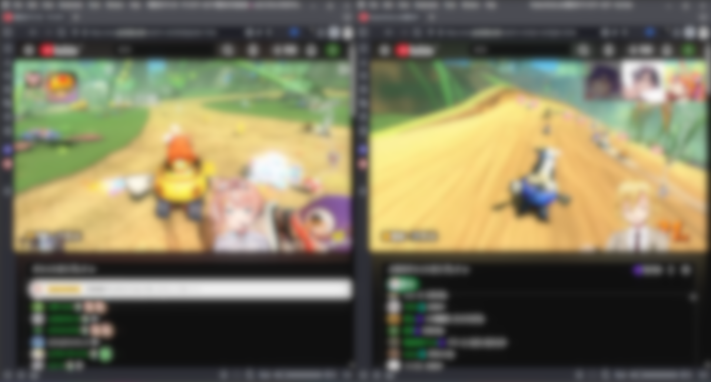

---

## YouTubeでの複数の動画を視聴 (WQHD)
新しいモニターを買ったら...

<style scoped>
img {
  display: block;
  margin: 0 auto;
  max-width: 70%;
  height: auto;
}
</style>

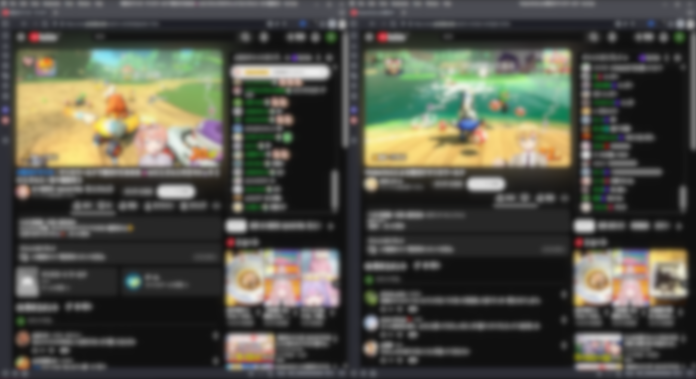

---

<style scoped>
/* スライド内の table 要素に margin: 0 auto; を適用 */
table {
  margin: 0 auto;
}
</style>

## YouTubeはページ幅が1000pxを境にレイアウトが変わります

横並びで複窓（2窓）にする時WQHDではチャット欄が動画プレイヤー横にくるための<br>動画プレイヤーのサイズが小さくなります


| | 画面幅 | 1窓辺りの幅 | チャット欄の位置 | 動画プレイヤーの横幅 |
| :---: | ---: | ---: | :---: | ---: |
| フルHD | 1920 | 960 | 動画プレイヤーの下 | 945 |
| WQHD | 2560 | 1280 | 動画プレイヤーの横 | 791 |

---
## 目的
- WQHDでの複窓の際に動画プレイヤーをフルHDの複窓表示より大きくしたい
- チャット欄はニコニコ風に表示する別拡張機能<sup>1</sup>の関係でDOM自体は削除したくない

→ チャット欄の配置を変更するchrome拡張機能を作ろう

>>> 1: [Flow Chat for YouTube Live](https://chromewebstore.google.com/detail/flow-chat-for-youtube-liv/elfdpkmfllnhhgnicaaeacbilcallpbd)


---
## 成果物
chrome拡張機能: https://github.com/yAtomtom/youtube-chat-rearranger
動画が幅に対して真ん中に表示されます．

<style scoped>
/* 画像をスライド中央に配置 */
img {
  display: block;
  margin: 0 auto;
  max-width:70%;
}
</style>

<!-- 要再撮影(v1.2): リプレイボタン自動クリック後、アーカイブのチャットが表示された状態 -->
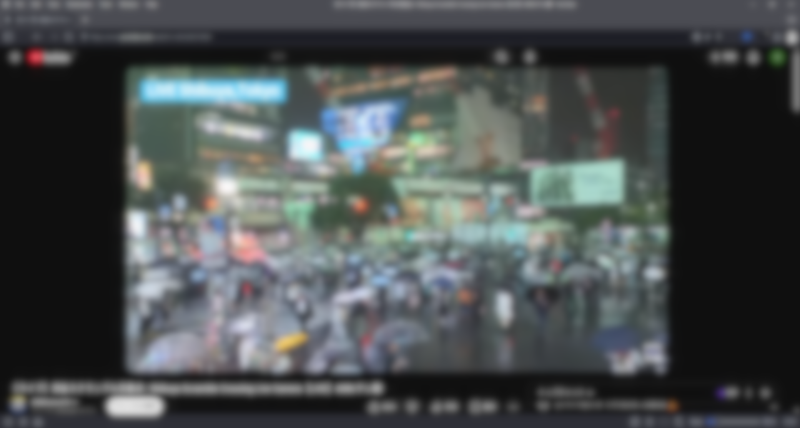

---

# YouTubeのレイアウト

---
## 基本構成

```html
<ytd-watch-flexy>
  <div id="full-bleed-container" class="style-scope ytd-watch-flexy">
    ...
  </div>
  <div id="columns" class="style-scope ytd-watch-flexy">
    <div id="primary" class="style-scope ytd-watch-flexy">
      ...
    </div>
    <div id="secondary" class="style-scope ytd-watch-flexy">
      ...
    </div>
  </div>
</ytd-watch-flexy>
```
---
<style scoped>
/* 画像をスライド中央に配置 */
img {
  display: block;
  margin: 0 auto;
  max-width: 40%;
}
</style>

## two columns layout
- full-bleed-containerは表示されずに2カラム表示になる
- primary, secondary は幅の上限やマージンが存在する

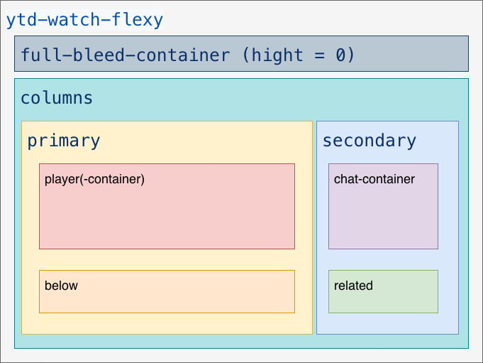

---

<style scoped>
/* 画像をスライド中央に配置 */
img {
  display: block;
  margin: 0 auto;
  max-width: 40%;
}
</style>

## single column layout
- secondaryは表示されずにfull-bleed-containerとprimaryで1カラム表示になる
- full-bleed-container は幅の上限やマージンがなくシアターモードでも使用される

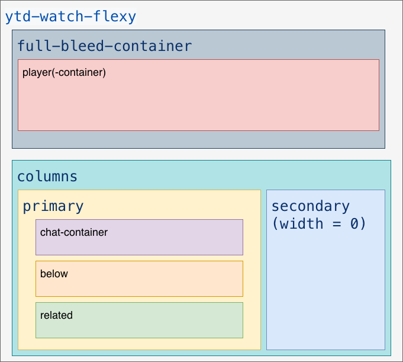

---

## 戦略候補: DOM移動 vs CSS変更
チャット欄(`#secondary`)を動画下に持ってくる方法は大きく2通り

<style scoped>
table { margin: 0 auto; }
section table { font-size: 0.8em; }
</style>

| 観点 | DOM移動 | CSS変更（CSS Grid） |
| :--- | :--- | :--- |
| やり方 | `secondary`を`primary`の子へ移動 | `#columns`にGridを当て見た目だけ再配置 |
| DOM構造 | 変わる | 不変（`display: contents`で透明化） |
| iframeチャット | 再挿入で壊れる（`about:blank`） | 影響なし |
| 仕様変更への強さ | 弱い（`src`の自前再構築が必要） | 強い |

→ DOM移動には iframe が壊れる落とし穴がある．本稿では<br>**DOM 移動を試みた後 CSS Grid で見た目だけ変える**方法を紹介する

---

# 拡張機能の作り方

---

## manifest.jsonの例

<style scoped>
/* コードブロックのフォントサイズを細かく調整 */
section pre {
  font-size: 0.6em;
}
</style>

manifest.json を含むプロジェクトフォルダを`chrome://extensions/`から読み込めばよい

```json
{
  "name": "YouTube Chat Rearranger",
  "version": "1.2",
  "manifest_version": 3,
  "description": "ライブ・アーカイブでYouTubeチャット欄をbelow(説明欄，コメント欄)と横並びにします",
  "permissions": ["storage"],
  "action": {
    "default_title": "YouTube Layout Modifier",
    "default_popup": "popup.html"
  },
  "content_scripts": [
    {
      "matches": ["*://www.youtube.com/watch*"],
      "js": ["content.bundle.js"],
      "css": ["styles/layout.css"],
      "run_at": "document_end"
    }
  ]
}
```

---

## manifest.jsonのkeyの例
- manifest_version
 マニフェスト ファイル形式のバージョン.
 使用できるkeyやブラウザによって対応状況が違う
- content_scripts
 URL がマッチしている場合にjsやCSSを読み込む
 （今回は `js` にバンドル、`css` にレイアウト定義 `styles/layout.css` を指定）
 `run_at: document_end` でDOM構築直後に読み込む
- action
  ツールバーの拡張機能アイコンに外観や動作を定義

参考
https://developer.chrome.com/docs/extensions/reference/manifest
https://developer.mozilla.org/ja/docs/Mozilla/Add-ons/WebExtensions/manifest.json

---

# チャット欄の配置を変更する

---

## まずは DOM 移動を試す

---
## コード例（DOM移動・試行）
```js
const player = document.getElementById('player');
const below = document.getElementById('below');
const secondary = document.getElementById('secondary');

// 新しいレイアウト用ラッパー
const layout = document.createElement('div')

// layout に below, secondary を移動
layout.appendChild(below);
layout.appendChild(secondary);

// layout を player の直後に挿入
const parent = player.parentNode; // primary
parent.insertBefore(layout, player.nextSibling);
```
---

<style scoped>
/* 画像をスライド中央に配置 */
img {
  display: block;
  margin: 0 auto;
  max-width: 40%;
}
</style>

## DOM移動するとチャット欄が表示されない．．．

<!-- 要再撮影(v1.2): DOM移動を試したときのチャット欄が壊れた状態（"Something went wrong"）。現行ビルドでDOM移動を再現して撮影 -->
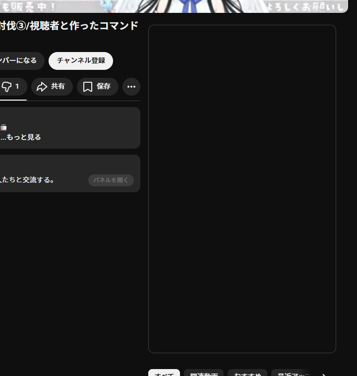

---
## なぜ壊れるか: iframe.contentWindow.location.href

チャット欄は iframe (`#chatframe`)。**DOM移動で再挿入されると navigable が作り直される**のが原因．

HTML(Living Standard) の仕様上、再挿入された iframe は src 属性を持たないと<br>`contentWindow.location.href` が `about:blank` になる（中身が空に）．

```html
<iframe id="chatframe" class="style-scope ytd-live-chat-frame">
  #document(about:blank)
  <html><head></head><body></body></html>
</iframe>
```
- [切り離し時のchild navigableの削除](https://html.spec.whatwg.org/multipage/iframe-embed-object.html#the-iframe-element:the-iframe-element-7)
- [挿入時のiframe attributeの処理](https://html.spec.whatwg.org/multipage/iframe-embed-object.html#otherwise-steps-for-iframe-or-frame-elements)

---
## 回避策（src再構築）と、その限界
壊れた iframe の `src` を自前で再構築すれば一応直せる（`live_chat?v=...` を設定するなど）．

しかしこの方針は脆い:
- アーカイブでは `live_chat_replay?continuation=...` とパラメータが変わり、トークン抽出が必要
- YouTube 側の仕様変更に追従し続ける必要がある
- そもそも **iframe を再挿入したこと**が問題の根源

→ **DOM を動かさなければ iframe は壊れない**．見た目だけ CSS で変えればよい．

---
## 採用案: DOMを動かさず CSS Grid で再配置
`#columns` に `.ytcr-active` を付け、`#primary`/`#primary-inner` を `display: contents` で“透明化”すると、子の `#below`/`#secondary` が直接 grid item になる
（DOMは不動）．

<style scoped>
section pre { font-size: 0.55em; }
</style>

```css
#columns.ytcr-active {
  display: grid !important;
  grid-template-columns: 2fr 1fr;
  grid-template-areas:
    "player player"
    "below secondary";
}
/* primary を透明化して子を grid item に昇格 */
#columns.ytcr-active > #primary,
#columns.ytcr-active #primary-inner { display: contents !important; }

#columns.ytcr-active #player    { grid-area: player; }
#columns.ytcr-active #below     { grid-area: below; }
#columns.ytcr-active > #secondary { grid-area: secondary; }
```

---
## 表示OK

<style scoped>
/* 画像をスライド中央に配置 */
img {
  display: block;
  margin: 0 auto;
  max-width:80%;
}
</style>

<!-- 要再撮影(v1.2): CSS Grid適用後のライブ配信表示（チャット欄がbelowと横並び） -->
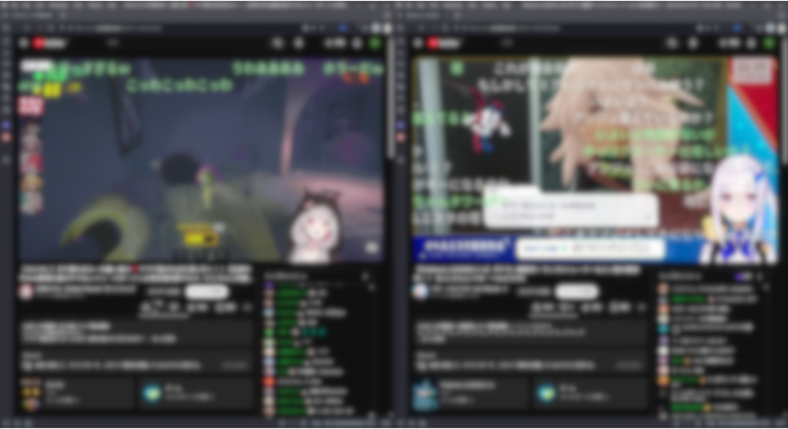

---

# まとめ
- 目的: WQHD の複窓で動画を大きくしたい。ただしチャット欄の DOM は残したい
- DOM 移動だと iframe (`#chatframe`) が再挿入で `about:blank` になりチャットが壊れる
- → **DOM を動かさず CSS Grid（`display: contents`）で見た目だけ再配置**して回避

---

# 付録

---

## 1. continuation

<style scoped>
/* コードブロックのフォントサイズを細かく調整 */
section pre {
  font-size: 0.5em;
}
</style>

ライブ配信ではGETを常に連続して叩くことでチャットを取得しているが
アーカイブ動画ではcontinuationというトークンを基に一定間隔で効率的に取得

リプレイ表示ボタンを押すと、**YouTube本体が**このトークンを使ってチャットをまとめ取得する（DOM移動時は自前で取得し直す必要がある）．

GETのレスポンスbody（抜粋）:

```json
"continuationContents": {
  "liveChatContinuation": {
    "continuations": [
        {
            "liveChatReplayContinuationData": {
                "timeUntilLastMessageMsec": 5000,
                "continuation": "op2w0wR8Gl5DaWtxSndvWVZVT...."
            }
        },
        ...
    ],
    "actions": [...]
  }
}
```

---

## 2. DOM変更によるバグの例
シークバーを動かすと薄暗い映像が部分的に表示

<style scoped>
/* 画像をスライド中央に配置 */
img {
  display: block;
  margin: 0 auto;
  max-width:60%;
}
</style>

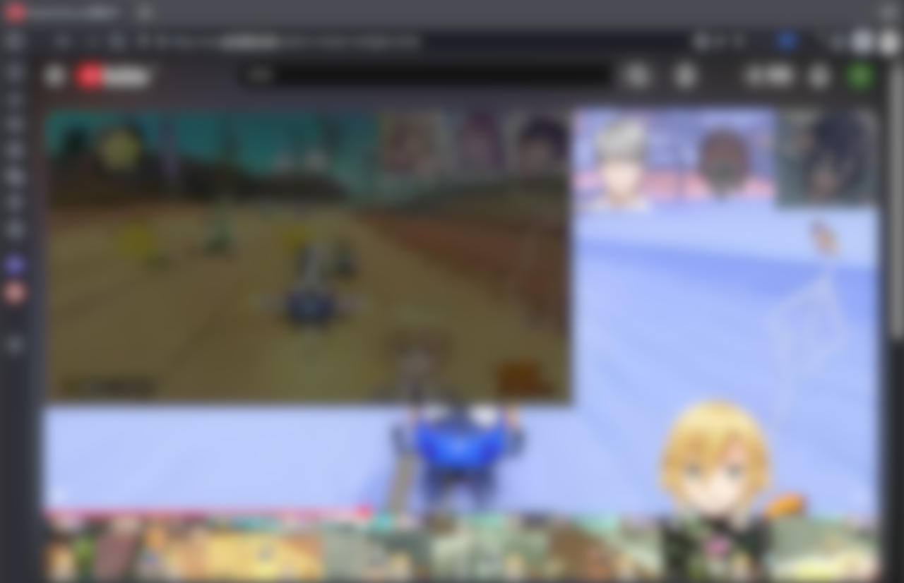

---
## とりあえずhtmlをみてみる
```html
<div class="ytp-storyboard-framepreview" data-layer="4" style="">
  <div class="ytp-storyboard-framepreview-timestamp">1:09:48</div>
  <div class="ytp-storyboard-framepreview-img"
     style="
       width: 697.084px;
       height: 393px;
       margin: 0px 1px 0px 0px;
       background: url('https://i.ytimg.com/sb/KU0qH-UmXfg/storyboard3_L3/M46.jpg?sqp=xxx&sigh=yyy')
                   -1396px -393px / 2094px 1179px;
     ">
  </div>
</div>
```
---
## storyboard
スプライト画像の一つで、複数の画像を1つの画像ファイルにまとめて管理し、
必要な部分を切り出して表示するもの.

<style scoped>
div.image-row {
  display: flex;
  justify-content: center;
  align-items: center;
  gap: 20px;
}
div.image-row img {
  width: 45%;
}
</style>

<div class="image-row">
  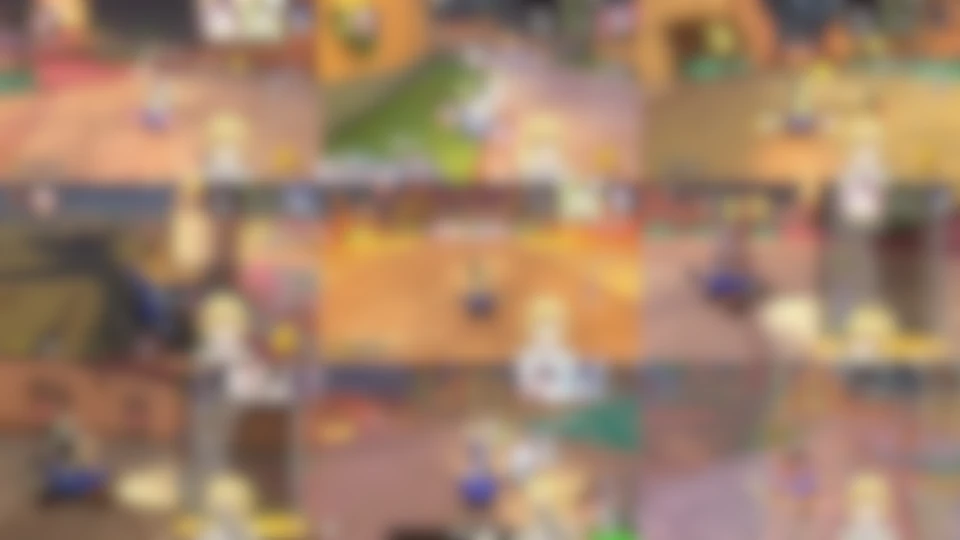
  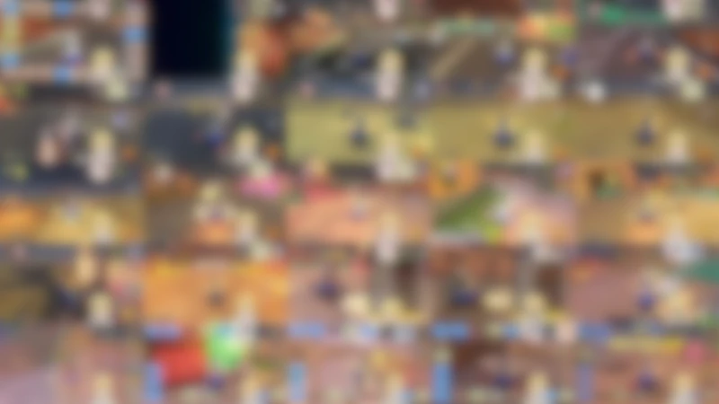
</div>

---
## 拡大してあげる

```js
const player = document.querySelector('div.style-scope.ytd-player');
const previewImg = document.querySelector('.ytp-storyboard-framepreview-img');

// 拡大率計算
const scaleX = player.clientWidth / previewImg.clientWidth;
const scaleY = player.clientHeight / previewImg.clientHeight;

// transform で拡大（左上基準で拡大）
previewImg.style.transformOrigin = 'top left';
previewImg.style.transform = `scale(${scaleX}, ${scaleY})`;
```

---
## 余談: scrubbing-thumbnail
シークバー下部では5×5のstoryboardを最大100枚使い2500のシーク箇所を表示.
動画は最大12時間(43200秒)なので約17秒間隔でシーク箇所を表示することが可能.

<style scoped>
/* 画像をスライド中央に配置 */
img {
  display: block;
  margin: 0 auto;
  max-width:50%;
}
</style>


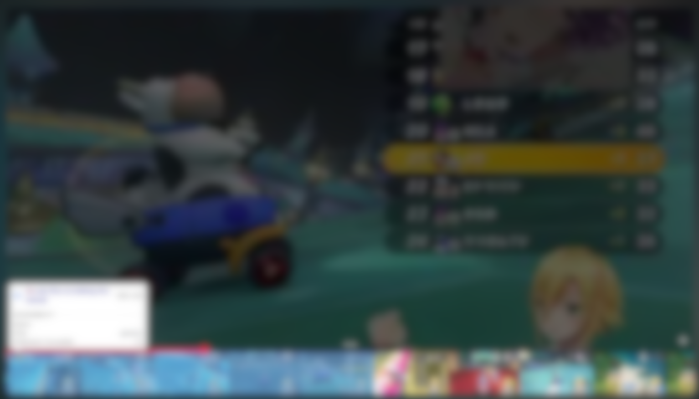

